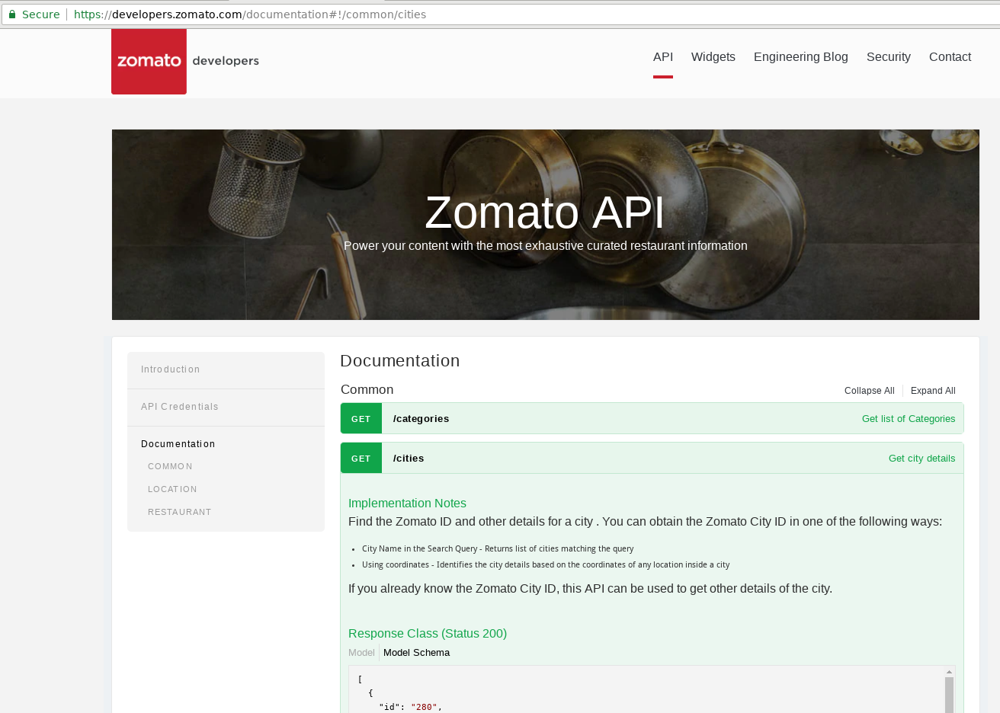
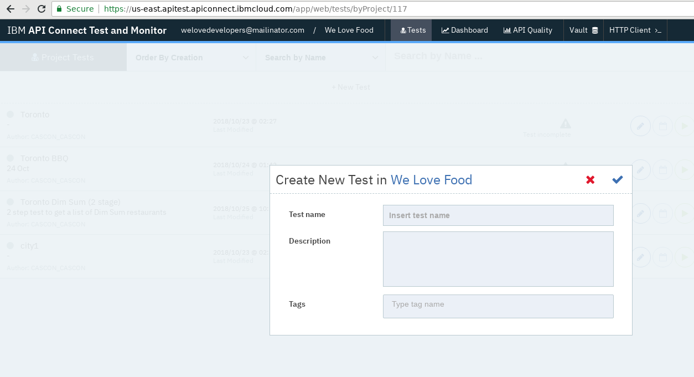
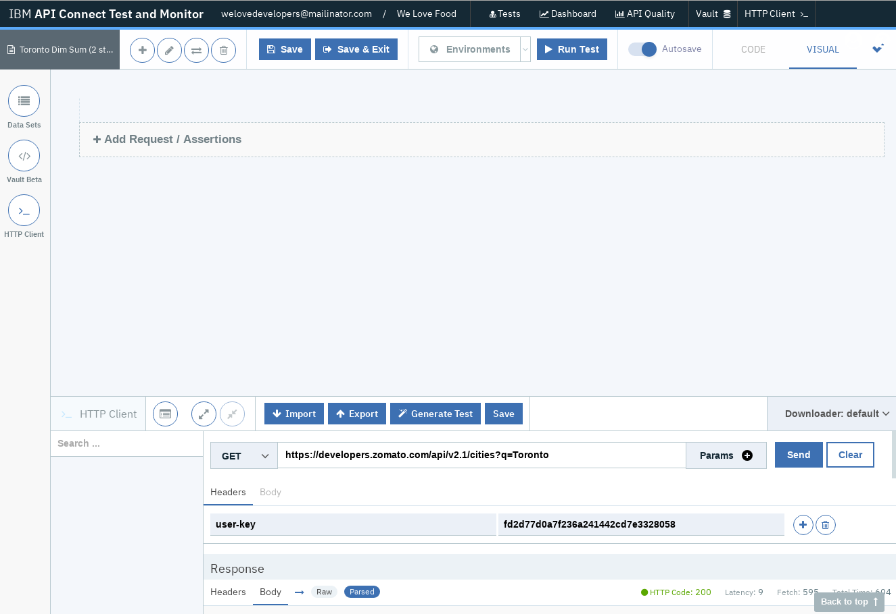
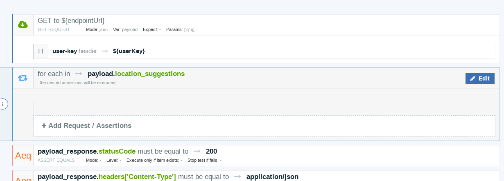
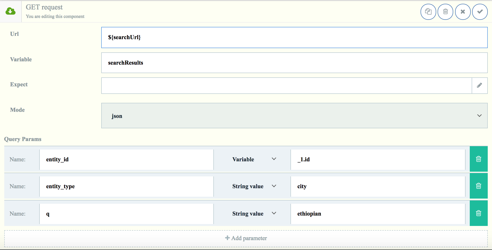
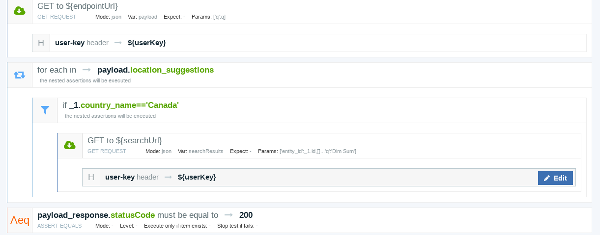

# Cascon 2018: Welcome to our API Connect & LoopBack workshop!

## Agenda
* Introduction
* External APIs
* Hands on with Zomato Food Search
* Test and Monitoring
* Q&A

## Prerequisites
Each workshop attendee should have a way of logging in to API Connect Test and Monitor here: ibm.biz/apitest

## Overview
### 1. Introduction
This describes how to demonstrate some intermediate to advanced usage of API Connect Test and Monitor by constructing an integration test based on a real world user story. Using the free Zomato API, we can search for restaurants meeting a certain criteria. This document will demonstrate how.

### 2. Obtaining an API key
As the Zomato API is a paid-for service, it requires an API key, however the first 1,000 calls per month are free of charge. In this demo I will show my API key but please don’t use it, as we might run out of calls. Each user should go to https://developers.zomato.com/api and click the “Generate API key” button. You can sign up with email or sign in using Google or Facebook.

### 3. Testing the API key
Once the API key has been obtained, go to https://developers.zomato.com/documentation and find the /cities endpoint. Click on it and the section should expand.

    

Scroll down until you can see the Parameters section. Enter the following:

    user-key: 	(your API key)
    q:		Toronto

Now click “Try it out”. Make sure the output looks like:

    { "location_suggestions":
	[ { "id": 89,
	    "name": "Toronto, ON",
	    "country_id": 37,
	    "country_name": "Canada", 
        ... }, ...

### 4. Building the test
* First, log into Test + Monitor, create a project if necessary and create a new test, and choose a name.

    

* Press Compose and choose “Quick start from an API call”. 
* Take the following URL: https://developers.zomato.com/api/v2.1/cities?q=Toronto and paste it into the “Request url” input in the bottom pane of the screen, then enter “user-key” as a header, then your API key. 
* Then click send. HTTP code should be 200 and the Response body should look the same as from the cities call in the Zomato web page.

    

* Now click “Generate Test” and keep clicking “Continue” until “All set!” appears and then click “Close”. The test will populate with one GET and several assertions.
* Next, expand “Data Sets” from the left and you should see “GLOBAL PARAMETERS” with a single entry underneath, which is called “endpointUrl” and has the value of the /cities endpoint URL. You can add another global parameter, call it “searchUrl” and give it the value of the Zomato /search endpoint URL. 

The screen should now look like this:

    

* Note the “user-key” header underneath the GET element. 
* Now add a for...each loop by clicking on the “+” button near the top-left and then click on the blue “Each” circle. This will spawn at the bottom of the test definition so drag it up until it sits underneath the GET (this is not strictly necessary but makes comprehension easier). 
* Edit the “Expression” field to be “payload.location_suggestions”. 
    * This will loop through each city called “Toronto”. 
* Confirm using the tick button and then click on the “for each” element so it expands, like this:

    

* Now click “Add Request / Assertions” and choose the blue “If Component” icon. 
* Edit the “Expression” to be “_1.country_name==’Canada’” (must be single quotes around Canada!). 
    * Since there are multiple cities called “Toronto” in other countries, we can use the “if" to find the one that’s in Canada.
* Next click on the “if” component and click “Add Request / Assertions” and choose the green “GET” symbol. 
* Enter the “Url” value as “${searchUrl}” and give the “Variable” field as “searchResults”.
* Now under “Query Params” click “Add parameter” and add the values for each of the following:

        Name: entity_id, Variable: _1.id
        Name: entity_type, String value: city
        Name: q, String value: “Dim Sum” (or example cuisine of your choice).
        Name: count, String value: 10

The GET should now look like this:

    

* Confirm with tick icon in top right. Now look up to find the user-key header. 
* Click on it, then click on the vertical ellipsis (three square dots) and choose “Clone component”, then without changing anything, confirm with the tick at the right. 
* Now click and hold the new header element and drag it under the GET to the search URL. (If this is proving difficult, alternatively you can edit the /search GET element and add the header manually).

Your screen should look like this:

    

At this point we can run the test. 
* Click “Save” then “Run Test” and choose default downloader, then “Run Test” again. 
    * If nothing happens, your browser is probably blocking popups, so look for a warning to the right of the address bar and click on it to allow popups from this site only. Otherwise a new tab will open titled “Test Report” and containing 2 GET requests and a number of assertions.
* Now for each of the GET requests, click “See Request” and scroll to the bottom of the right-hand pane and click “Load source”. 
* Then scroll down again and show the resulting JSON data from each of the calls.

### 5. Extra credit
If there is any time left, try out the following tasks:
1. Add a variable to the input set “generated-set-0” which holds the value of the cuisine, then use that variable in the /search GET request.
2. Add an assertion to one of the GET requests (/search). This could be to check there was a number of results returned, which should be an integer. HINT: use assert-is and _1.results_found

### 6. 45 minute version
The longer variant of the test uses three calls and can be reconstructed easily enough from the following screenshot:

    

## Members
* Amir Jafarian: https://github.com/amir-61
* Biniam Admikew: https://github.com/b-admike
* Candy Ng: https://github.com/0candy
* Ivy Ho: https://github.com/smartmouse
* Jisoo Lee: https://github.com/jisoolee
* JJ Tang: https://github.com/jjtang1
* Nora Abdelgadir: https://github.com/nabdelgadir
* Peter EL-Koreh: https://github.com/elkorep
* Wendy Hua: https://github.com/hwd8
